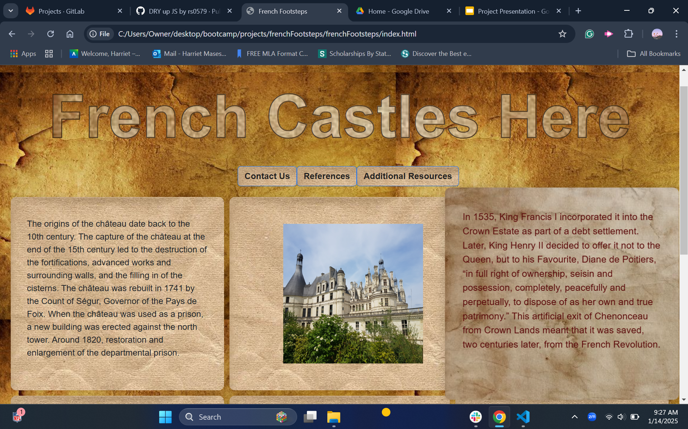

What was your motivation?
RS: Our group's motivation for creating this dynamic, interactive learning tool originates from an interest in French historical architecture and a desire to spread awareness of a few gems spread throughout the country. From the home of the Renaissance kings, the _Centre-Val-de-Loire_ to the heart of the Occitan south in _Ariege_, we explore a few of France's most significant cultural monuments.
Why did you build this project? (Note: the answer is not "Because it was a homework assignment.")
RS: We have built this project to apply many of the key skills that we have acquired over the course of our learning experience. This project allows us to take the theoretical content that have learned and utilize it in a creative yet technically proficient manner. 
What problem does it solve?
RS: This project aims to instruct the user on a few of France's most recognizable historical monuments from the lens of connoisseur of French society and culture
What did you learn?
RS: Each of us learned key skills that helped us achieve our goal. We explored the use of the the "onclick" attribute, allowing the user to expose some of our unique images. We worked collaboratively to resolve issues linked to position, margin, padding and the like. We have uncovered the utility of modals, applying their properties to our peoject. We watched and learned how to make use of the localStorage feature in JS. Among many other things that had only been theoretical up untl then.
What makes your project stand out?
RS: What makes our project stand out from the rest is that it reflects a real-world experience that one of colllegues had throughout the course of their travels. It also incorpartes new concepts that were discovered through independent research and in class. The visual representation of our app is also quite remarkable, inspired by historical pages from tomes such as _Les Très Riches Heures des ducs de Berry_ and _La Cité des dames_.

# French Footsteps: An exploration of Fortified France.

## This interactive educational gallery is accessible across various media and facilitates the storage and callback of user submitted contact data and comments.

Provide a short description explaining the what, why, and how of your project. Use the following questions as a guide:

- What was your motivation?
- Why did you build this project? (Note: the answer is not "Because it was a homework assignment.")
- What problem does it solve?
- What did you learn?

## Table of Contents (Optional)

If your README is long, add a table of contents to make it easy for users to find what they need.

- [Installation](#installation)
- [Usage](#usage)
- [Credits](#credits)
- [License](#license)

## Installation

"French Footsteps: A Journey through Fortified France" is accessible for free on the internet, best suited to chrome browsers. 

## Usage

Provide instructions and examples for use. Include screenshots as needed.

To add a screenshot, create an `assets/images` folder in your repository and upload your screenshot to it. Then, using the relative filepath, add it to your README using the following syntax:

    ```md
    
    ```

## Credits

Raheem Senegal

Aley Wigwe

Harriet Masese

Jason Gerdes

If you used any third-party assets that require attribution, list the creators with links to their primary web presence in this section.

If you followed tutorials, include links to those here as well.

## License

The last section of a high-quality README file is the license. This lets other developers know what they can and cannot do with your project. If you need help choosing a license, refer to [https://choosealicense.com/](https://choosealicense.com/).

---

🏆 The previous sections are the bare minimum, and your project will ultimately determine the content of this document. You might also want to consider adding the following sections.

## Badges


Badges aren't necessary, per se, but they demonstrate street cred. Badges let other developers know that you know what you're doing. Check out the badges hosted by [shields.io](https://shields.io/). You may not understand what they all represent now, but you will in time.

## Features

1. An interactive grid of photos, each responsive to various user interactions including hover, click, and change in view screen size.
2. A pop-up modal for user contact form (name, email, message) that stores formdata to an array onto the localstorage.
3. A pop-up modal that provides a list of references concerning data communicated on the site, with appropriate hyperlinks.
4. A pop-up modal that provides a list of additional resources for users interested in further exploration of French Castles.


## How to Contribute

If you created an application or package and would like other developers to contribute it, you can include guidelines for how to do so. The [Contributor Covenant](https://www.contributor-covenant.org/) is an industry standard, but you can always write your own if you'd prefer.

## Tests

Go the extra mile and write tests for your application. Then provide examples on how to run them here.
